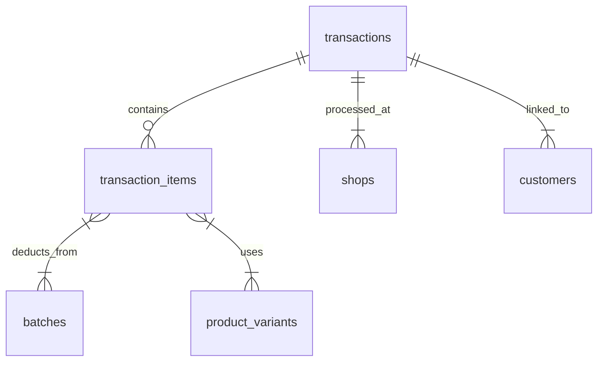

### **Database Structure Design** 
#### **Core Tables**
1. **Shops** 
   - `id` (UUID primary key)
   - `name` (e.g., "Sanaiya 1", "Sanaiya 2", "Hafith")
   - `type` (enum: 'main', 'branch')
   - `inventory_id` (links to inventories table)

2. **Inventories**
   - `id` (UUID)
   - `name` (e.g., "Main Shared Inventory")
   - `shop_id` (nullable for shared inventory)

3. **Products**
   - `id` (UUID)
   - `name` 
   - `category_id` (references categories)
   - `brand_id` (references brands)
   - `is_oil` (boolean for volume toggle)

4. **Product Variants** (for volumes/pricing)
   - `id` (UUID)
   - `product_id`
   - `volume` (e.g., "5L", "1L")
   - `price`

5. **Batches** (FIFO tracking)
   - `id` (UUID)
   - `product_id`
   - `inventory_id`
   - `cost_price`
   - `quantity`
   - `expiry_date`
   - `received_at`

6. **Categories & Brands**
   - Nested categories for filters/parts (parent-child relationships)
   - Brand management with shop-specific overrides

#### **Transaction System**


### **Supabase Setup & Config** 
1. **Project Initialization**
   - Create project in Supabase Dashboard
   - Enable Row Level Security (RLS) on all tables
   - Configure Google OAuth for staff logins 

2. **Environment Variables**
   ```env
   NEXT_PUBLIC_SUPABASE_URL=your_url
   NEXT_PUBLIC_SUPABASE_ANON_KEY=your_key
   SUPABASE_SERVICE_ROLE_KEY=server_only_key
   ```

3. **RLS Policies Examples**
   ```sql
   -- Shop-specific data access
   CREATE POLICY "Shop staff access" ON inventories
   USING (shop_id = current_setting('app.current_shop_id'));
   ```

### **Drizzle ORM Integration** 
#### **Critical Components**
1. **Schema Definition**
   ```typescript
   // schema.ts
   export const products = pgTable("products", {
     id: uuid("id").primaryKey().defaultRandom(),
     is_oil: boolean("is_oil").notNull(),
     // ...other fields
   });
   ```

2. **Transaction Handling**
   ```typescript
   // POS checkout function
   await db.transaction(async (tx) => {
     await tx.insert(transactions).values({...});
     await tx.update(batches).set({quantity: decrement(quantity)});
   });
   ```

3. **Redis Caching Strategy**
   - Cache product catalogs with 5-minute TTL
   - Bust cache on inventory updates

### **POS Workflow Implementation** 
1. **Category-Specific Logic**
   | Category        | Selection Flow                  | Data Structure         |
   |-----------------|---------------------------------|------------------------|
   | Lubricants      | Brand → Volume Modal → Add to Cart | Nested variants       |
   | Filters/Parts   | Product Head → Brand → SKU Modal | Hierarchical categories|
   | Additives       | Brand → Direct Selection        | Flat products          |

2. **Cart Processing**
   - Batch assignment using FIFO
   - Real-time inventory validation
   - Multi-shop cart isolation

### **Inventory Management** 
1. **Shared vs. Branch Inventories**
   ```mermaid
   graph TD
     A[Main Inventory] -->|Shared| B[Sanaiya 1]
     A -->|Shared| C[Sanaiya 2]
     D[Hafith Inventory] -->|Dedicated| E[Hafith Shop]
     F[Abu Dhurus Inventory] -->|Dedicated| G[Abu Dhurus Shop]
   ```

2. **Transfer System**
   - **Branch Transfer Flow:**
     1. Daily "Generate Sales" in Hafith/Abu Dhurus
     2. Auto-create transfer request to Main HQ
     3. HQ reviews in Restock Orders page
     4. Delivery dispatched after confirmation

### **Error Handling & Edge Cases** 
1. **Concurrency Issues**
   - Optimistic locking for inventory updates
   - Queue system for high-frequency POS operations

2. **Data Integrity Risks**
   - Foreign key constraints with cascading deletes
   - Atomic transactions for:
     - Checkout processes
     - Inventory transfers
     - Batch updates

3. **Failure Recovery**
   - Transaction rollback hooks
   - Pending operations audit table
   - Automated reconciliation jobs

4. **Performance Bottlenecks**
   - Materialized views for dashboard data
   - Redis caching for:
     - Product catalogs
     - Inventory counts
     - Customer records

### **Implementation Roadmap**
1. **Phase 1: Core Infrastructure (1-2 weeks)**
   - Supabase project setup with RLS
   - Drizzle schema migration
   - Auth system with shop-based roles

2. **Phase 2: POS & Inventory (2-3 weeks)**
   - Product catalog management
   - Batch-enabled inventory system
   - Category-specific POS workflows

3. **Phase 3: Reporting & Transfers (1-2 weeks)**
   - Dashboard with profit analytics
   - Transfer/restock workflows
   - Customer-vehicle management

4. **Phase 4: Optimization (Ongoing)**
   - Redis integration
   - Offline capability planning
   - Automated stock alerts

### **Critical Dependencies**
1. **Supabase Libraries**
   ```bash
   npm install @supabase/supabase-js @supabase/ssr
   ```

2. **Drizzle Configuration**
   ```typescript
   // drizzle.config.ts
   export default defineConfig({
     schema: "./src/db/schema.ts",
     dialect: "postgresql",
     dbCredentials: { connectionString: process.env.DATABASE_URL! }
   });
   ```

**Key Risks & Mitigation:**
- **Inventory Desync:** Implement real-time Supabase websockets for stock updates 
- **Failed Checkouts:** Transaction rollbacks with Drizzle's error handling 
- **Branch Transfer Errors:** Idempotency keys in transfer API calls
- **Data Corruption:** Daily Supabase backups with point-in-time recovery

